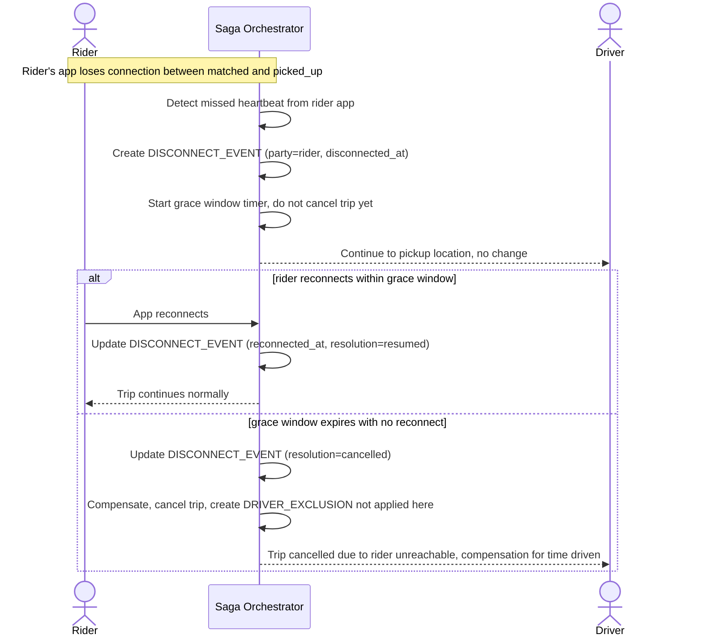

# Sequence Diagram — Enhance: Disconnect During Pickup, Grace Window

Đây là **enhance**, flow mới xử lý trường hợp app khách mất kết nối đúng lúc tài xế đang trên đường đón khách. Flow này thể hiện yêu cầu "không tự hủy chuyến ngay lập tức, cần cửa sổ chờ hợp lý để khách reconnect" — tránh hủy sai khi tài xế đã di chuyển gần tới nơi.

