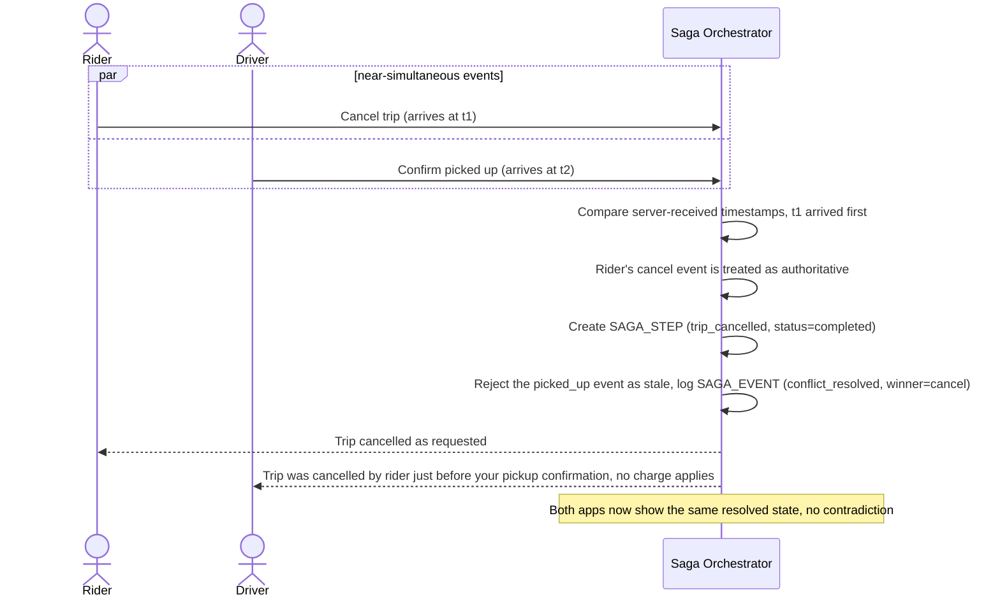

# Sequence Diagram — Enhance: Race, Cancel vs Pickup Confirm

Đây là **enhance**, flow mới xử lý race condition khi khách hủy chuyến đúng lúc tài xế bấm "đã đón khách" gần như đồng thời từ hai thiết bị độc lập. Flow này thể hiện yêu cầu có luật ưu tiên rõ ràng (sự kiện nào server nhận trước theo thời điểm xử lý được coi là hợp lệ) và bên thua phải nhận đúng thông báo trạng thái thực tế.

