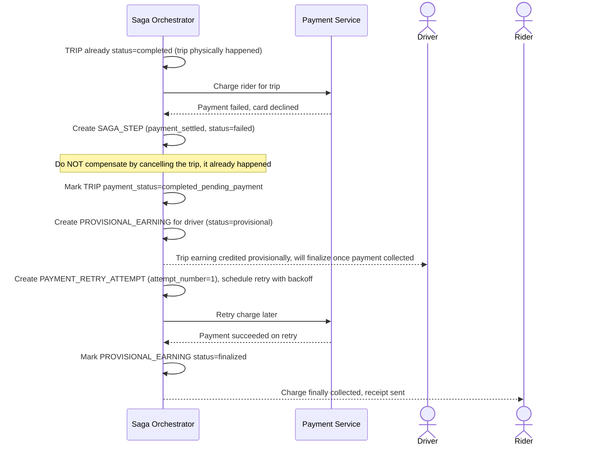

# Sequence Diagram — Enhance: Payment Failure After Trip Completion

Đây là **enhance**, flow mới xử lý trường hợp bước thanh toán cuối saga thất bại (thẻ bị từ chối) sau khi chuyến đã hoàn thành thực tế. Flow này thể hiện yêu cầu quan trọng: không compensate bằng cách "hủy chuyến" vì chuyến không thể hủy ngược, mà tách thành trạng thái riêng với retry/thu nợ và vẫn ghi nhận thu nhập tạm cho tài xế.

