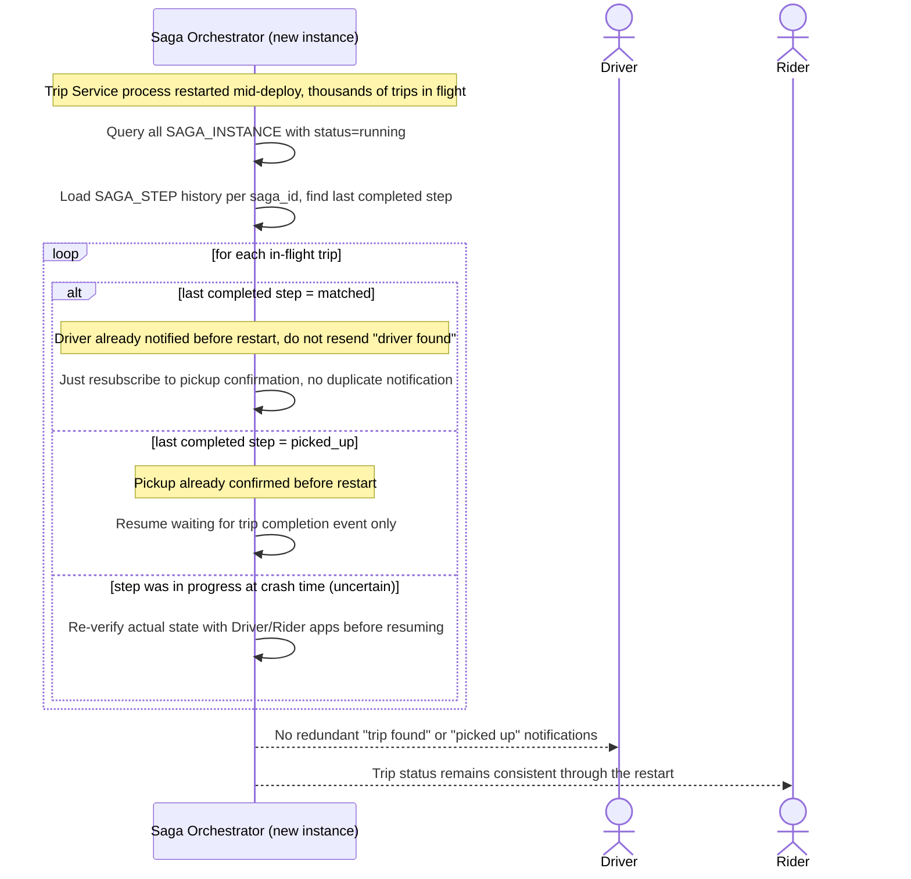

# Sequence Diagram — Enhance: Resume Saga After Service Restart

Đây là **enhance**, flow mới xử lý trường hợp Trip Service điều phối bị restart (ví dụ deploy) giữa lúc hàng nghìn chuyến đang diễn ra. Flow này thể hiện yêu cầu trạng thái từng chuyến phải persist đủ để không gửi lại thông báo cho bước đã qua từ trước, tránh gây nhiễu loạn app khách/tài xế.

