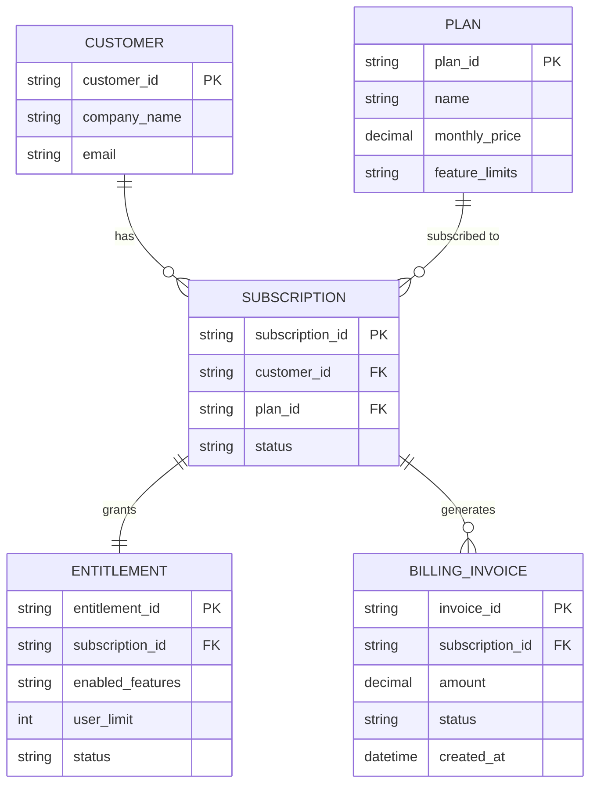

# ERD — Base (trước khi có saga đổi gói)

Đây là **base**: mô hình dữ liệu suy luận cho SaaS B2B *trước khi* có saga điều phối đổi gói. Đề bài giả định hệ thống đã có billing, entitlement, và notification như 3 service riêng biệt, mỗi khách hàng có subscription và entitlement tương ứng gói hiện tại — nếu không có sẵn các entity này thì "saga đảm bảo billing và entitlement luôn khớp nhau" sẽ không có nghĩa. ERD chỉ dựng phần lõi phục vụ đổi gói, không suy diễn thêm các module không liên quan (support, usage analytics...).

