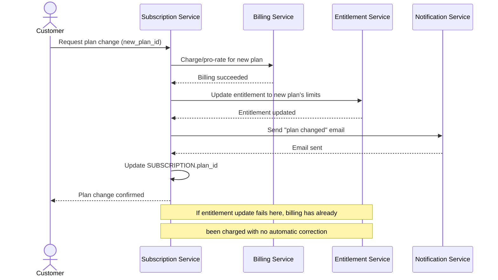

# Sequence Diagram — Base: Change Plan

Đây là **base**, flow "đổi gói" gọi Billing và Entitlement riêng lẻ — tiền đề cho saga. Ở base, flow chưa đảm bảo thứ tự chặt chẽ hay khả năng compensate: nếu Entitlement Service lỗi sau khi Billing đã charge thành công, khách có thể bị tính tiền plan mới nhưng chưa được mở tính năng tương ứng.

