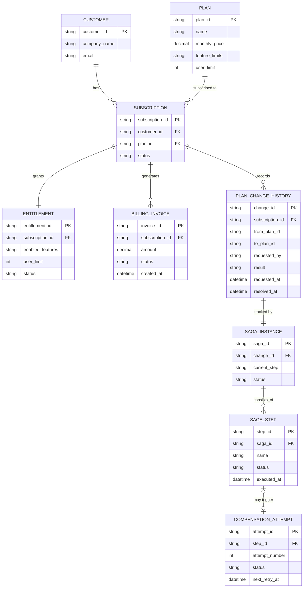

# ERD — Enhance (sau khi có saga đổi gói)

Đây là **enhance**: ERD base cộng với các entity phục vụ đúng 5 yêu cầu của đề bài — thứ tự saga rõ ràng (billing trước, entitlement sau), retry/compensate khi entitlement down, kiểm tra hạn mức khi downgrade, notification chỉ gửi sau khi ổn định, và lịch sử đổi gói truy vấn được. So với base, `SUBSCRIPTION` nay được dẫn dắt bởi `SAGA_INSTANCE`, và có thêm `PLAN_CHANGE_HISTORY` ghi lại toàn bộ lượt đổi gói.

