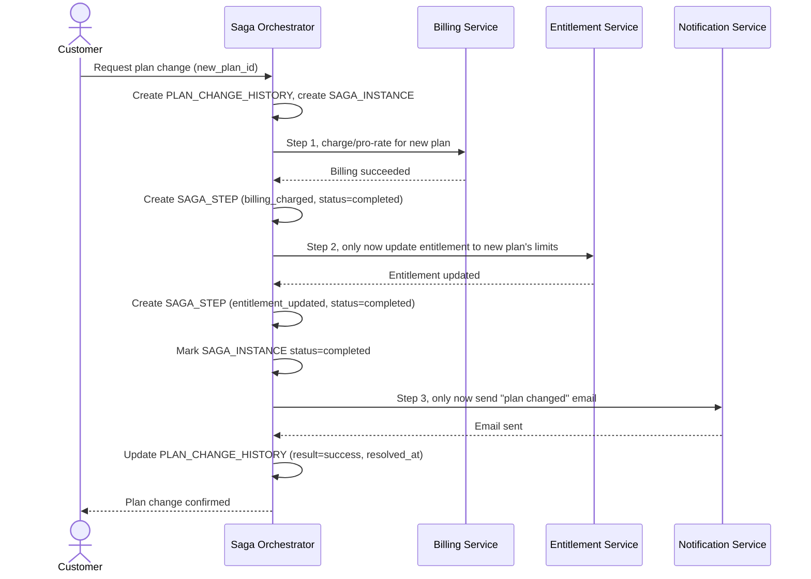

# Sequence Diagram — Enhance: Change Plan (Happy Path)

Đây là **enhance**, flow "đổi gói" đã có ở base ([2-base-change-plan-sqd.md](2-base-change-plan-sqd.md)) nhưng nay thay đổi căn bản: thứ tự saga chặt chẽ (billing trước, entitlement chỉ mở sau khi billing xác nhận thành công), và notification chỉ gửi sau khi cả hai đã ổn định, thay vì gọi rời rạc như base.

