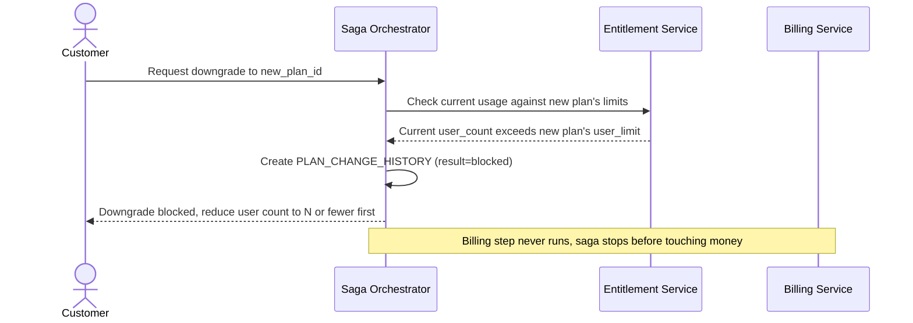

# Sequence Diagram — Enhance: Downgrade With Limit Check

Đây là **enhance**, flow mới xử lý downgrade khi khách đang dùng tính năng vượt hạn mức plan mới (ví dụ vượt số user). Flow này thể hiện quyết định "chặn downgrade" khi vượt hạn mức, thay vì âm thầm cắt tính năng gây gián đoạn dịch vụ.

