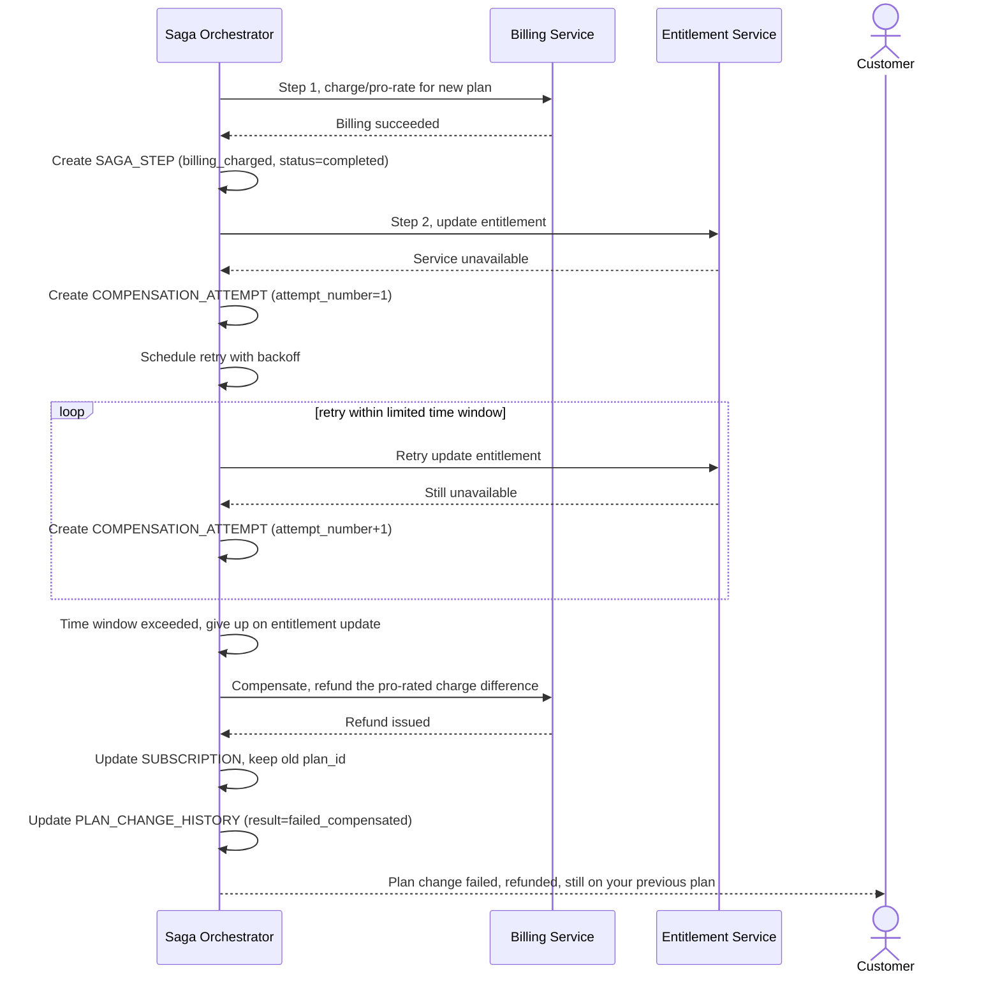

# Sequence Diagram — Enhance: Retry Entitlement Then Compensate

Đây là **enhance**, flow mới xử lý trường hợp Entitlement Service down đúng lúc cần cập nhật sau khi billing đã thành công. Flow này thể hiện yêu cầu retry với backoff trong khoảng thời gian giới hạn, và nếu vẫn thất bại thì compensate hoàn tiền phần chênh lệch, giữ nguyên plan cũ.

