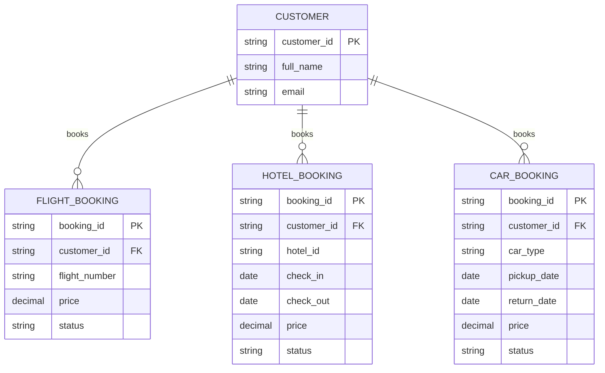

# ERD — Base (trước khi có saga đặt combo)

Đây là **base**: mô hình dữ liệu suy luận cho nền tảng đặt tour *trước khi* có saga đặt combo. Đề bài giả định nền tảng đã cho phép đặt riêng lẻ từng phần (vé máy bay, khách sạn, xe thuê) qua 3 service/nhà cung cấp khác nhau — nếu không có sẵn các entity đặt chỗ riêng lẻ này thì "saga đảm bảo tất cả hoặc không có gì cho combo" sẽ không có nghĩa. ERD chỉ dựng phần lõi phục vụ đặt chỗ, không suy diễn thêm các module không liên quan (loyalty, khuyến mãi...).

