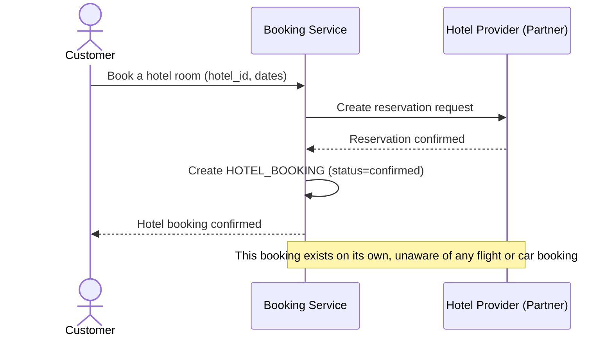

# Sequence Diagram — Base: Book Single Item

Đây là **base**, flow đặt riêng lẻ một phần (ví dụ đặt khách sạn) qua service nhà cung cấp tương ứng — tiền đề cho saga combo: đây là building block mà saga combo sau này sẽ gọi lặp lại cho cả 3 nhà cung cấp. Ở base, mỗi lần đặt độc lập, chưa có khái niệm phối hợp nhiều phần cùng lúc hay hủy dây chuyền.

