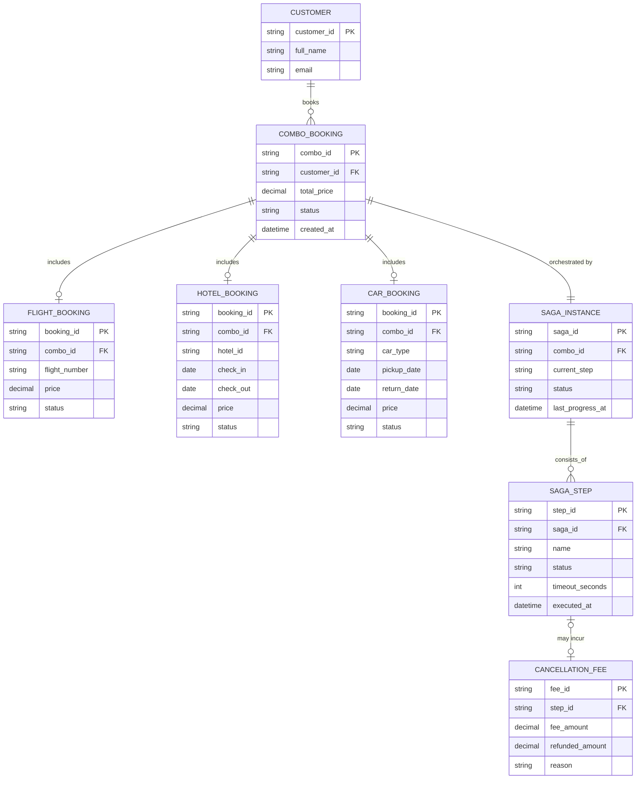

# ERD — Enhance (sau khi có saga đặt combo)

Đây là **enhance**: ERD base cộng với các entity phục vụ đúng 5 yêu cầu của đề bài — combo gộp 3 phần đặt riêng lẻ, thứ tự đặt theo rủi ro, timeout riêng từng bước, phí hủy khi compensate, trạng thái real-time, và phát hiện saga kẹt. So với base, các booking riêng lẻ không đổi cấu trúc nhưng nay đều thuộc về một `COMBO_BOOKING` và được saga điều phối.

