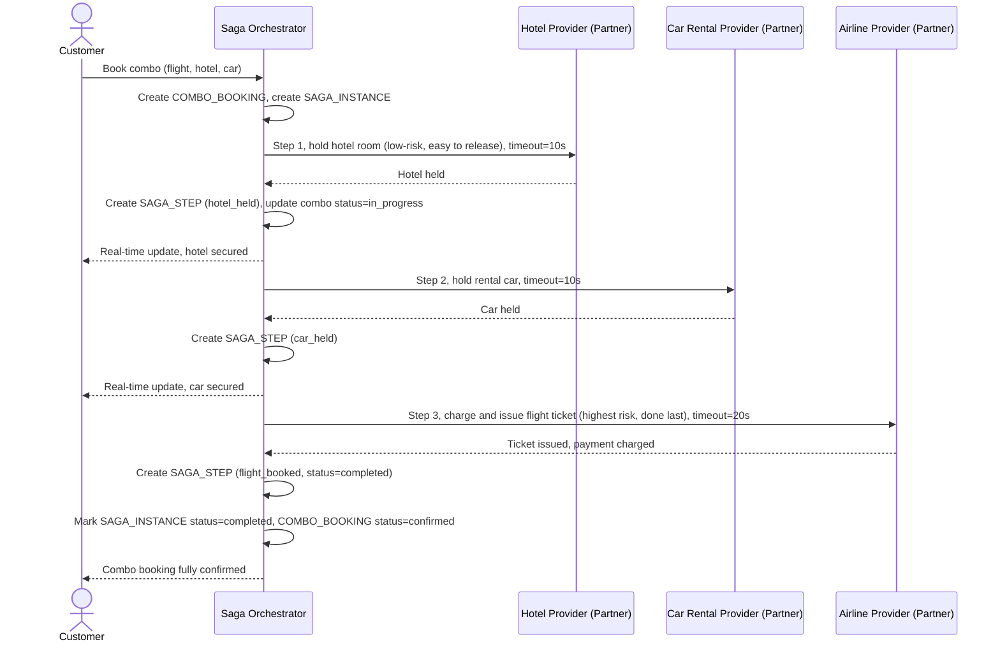

# Sequence Diagram — Enhance: Book Combo (Happy Path)

Đây là **enhance**, flow mới hoàn toàn gộp 3 lượt đặt riêng lẻ ([2-base-book-single-item-sqd.md](2-base-book-single-item-sqd.md)) thành một saga cho `COMBO_BOOKING`. Flow thể hiện yêu cầu thứ tự đặt phần dễ hủy/ít rủi ro trước (giữ chỗ tạm trước khi charge tiền thật), timeout riêng cho từng bước theo SLA của từng nhà cung cấp, và trạng thái real-time cho khách theo dõi.

