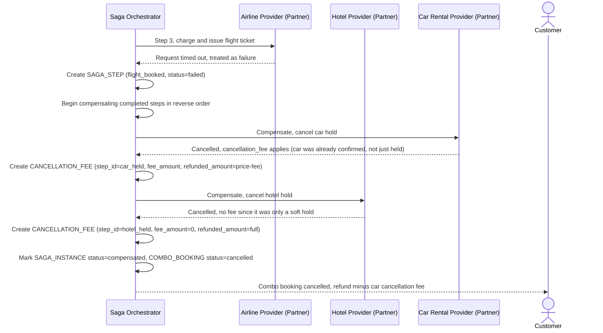

# Sequence Diagram — Enhance: Compensate With Cancellation Fee

Đây là **enhance**, flow mới xử lý trường hợp bước charge vé máy bay thất bại/timeout sau khi hotel và car đã giữ chỗ thành công. Flow này thể hiện yêu cầu compensate phải log và tính đúng phí hủy (cancellation fee) khi hủy khách sạn/xe, không hoàn nhầm 100% khi có phí hủy.

