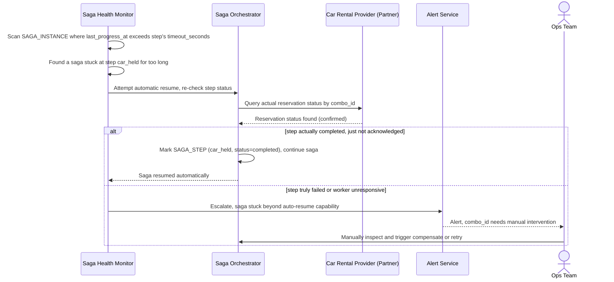

# Sequence Diagram — Enhance: Detect And Resume Stuck Saga

Đây là **enhance**, flow mới phát hiện saga "kẹt" quá lâu ở một bước (ví dụ worker xử lý bước đó chết) và tự động resume hoặc alert vận hành. Flow này thể hiện yêu cầu giám sát chủ động thay vì để khách chờ vô thời hạn không rõ trạng thái combo booking của mình.

