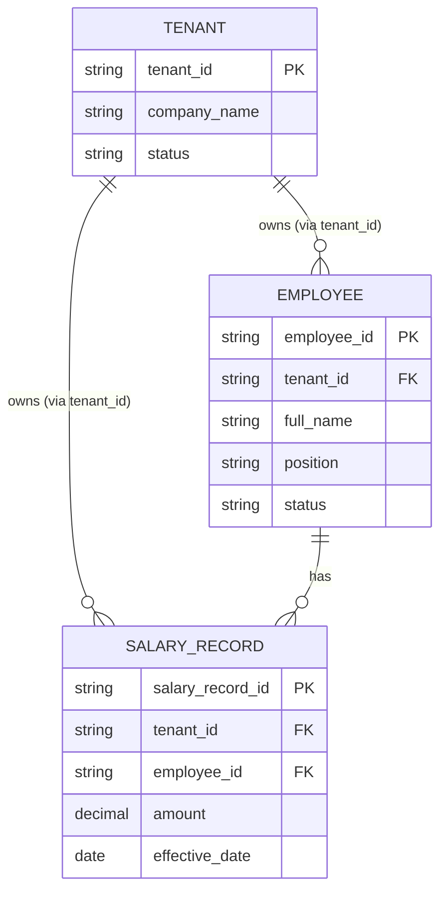

# ERD — Base (trước khi có schema-per-tenant migration)

Đây là **base**: mô hình dữ liệu suy luận cho SaaS quản lý nhân sự B2B *trước khi* có flow chuyển đổi schema. Đề bài nói rõ hệ thống đang dùng 1 schema chung với cột `tenant_id` để phân biệt dữ liệu các công ty khách hàng — nên base chỉ cần thể hiện đúng mô hình shared-schema này (một schema SQL duy nhất, mọi bảng nghiệp vụ đều có `tenant_id`), không suy diễn thêm module không liên quan tới việc migrate (payroll chi tiết, chấm công...). Giả định SQL vì `tenant_id` là mô hình multi-tenant kinh điển trên RDBMS quan hệ.

**Ghi chú:** tất cả bảng trên nằm chung trong 1 schema SQL duy nhất (ví dụ `public`), mọi truy vấn đọc/ghi đều phải filter theo `tenant_id`.
