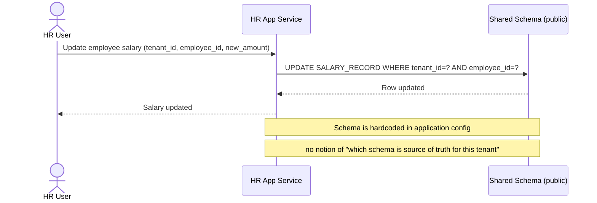

# Sequence Diagram — Base: Write Employee Data

Đây là **base**, flow ghi dữ liệu nhân sự (ví dụ sửa lương) trong mô hình shared-schema hiện tại — tiền đề cho việc migrate: chính flow ghi trực tiếp, không qua routing, này là thứ mà flow migration phải thay thế bằng cơ chế tra bảng routing trước khi ghi.

