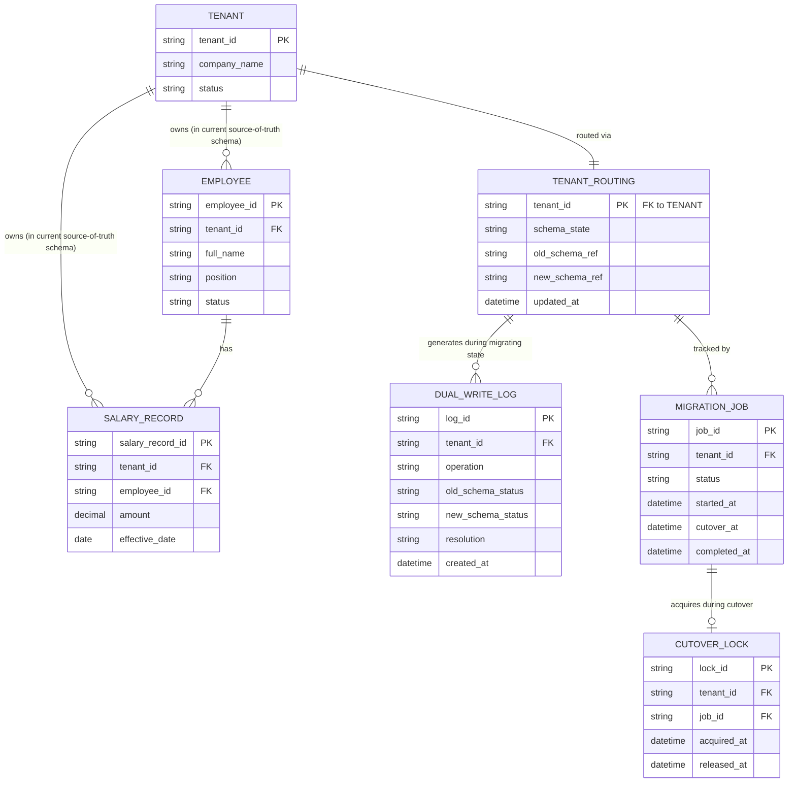

# ERD — Enhance (sau khi có schema-per-tenant migration)

Đây là **enhance**: ERD base cộng với các entity phục vụ đúng 4 yêu cầu của đề bài — routing table theo tenant, dual-write có xử lý thất bại một bên, đọc luôn từ schema nguồn sự thật, và rollback nhanh sau cutover. So với base, dữ liệu nghiệp vụ (`EMPLOYEE`, `SALARY_RECORD`) nay tồn tại tiềm năng ở CẢ HAI schema (`old_schema` dùng chung, `new_schema` riêng theo tenant) trong lúc migrate, và `TENANT_ROUTING` là nguồn quyết định duy nhất schema nào đang là "nguồn sự thật".

