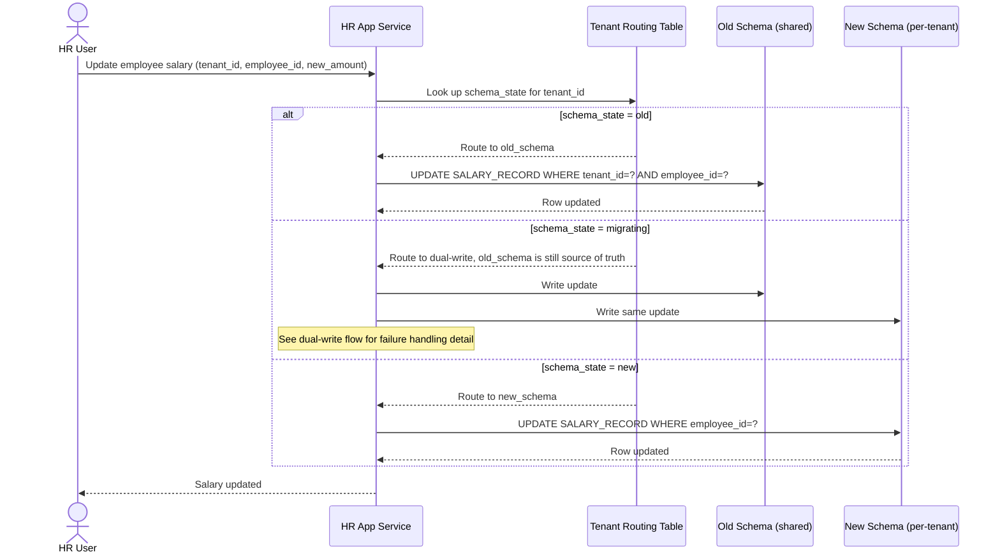

# Sequence Diagram — Enhance: Write Employee Data (Routed)

Đây là **enhance**, flow ghi dữ liệu nhân sự đã có ở base ([2-base-write-employee-data-sqd.md](2-base-write-employee-data-sqd.md)) nhưng nay thay đổi căn bản: mọi request phải tra `TENANT_ROUTING` trước khi ghi, không hardcode schema trong code app. Flow này cho thấy 3 nhánh khác nhau tùy `schema_state` của tenant.

