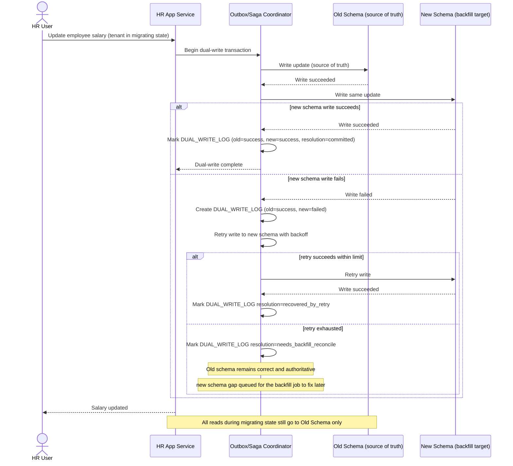

# Sequence Diagram — Enhance: Dual-Write Transaction

Đây là **enhance**, flow mới cho giai đoạn dual-write trước cutover: mọi write cho tenant đang migrate phải ghi cả 2 schema, có xử lý rõ khi một bên thất bại (retry hoặc rollback toàn bộ, không để một bên có một bên không). Flow này cũng thể hiện yêu cầu đọc luôn từ old schema (nguồn sự thật) trong giai đoạn này.

