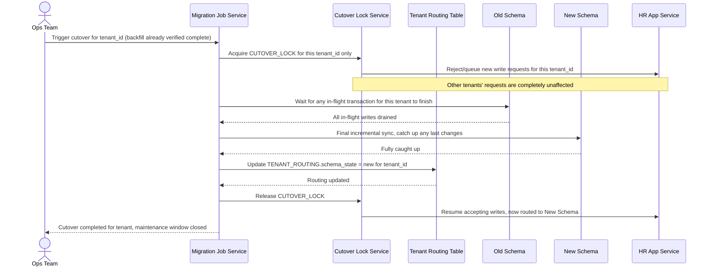

# Sequence Diagram — Enhance: Cutover Tenant

Đây là **enhance**, flow mới thực hiện cutover cho một tenant: khóa ghi tạm thời (vài giây) chỉ cho riêng tenant đó, chuyển routing từ old sang new schema, rồi mở khóa — trong khi các tenant khác không bị ảnh hưởng. Flow này thể hiện đúng tình huống "request đang giữa transaction ghi vào schema cũ ngay tại thời điểm chuyển routing".

