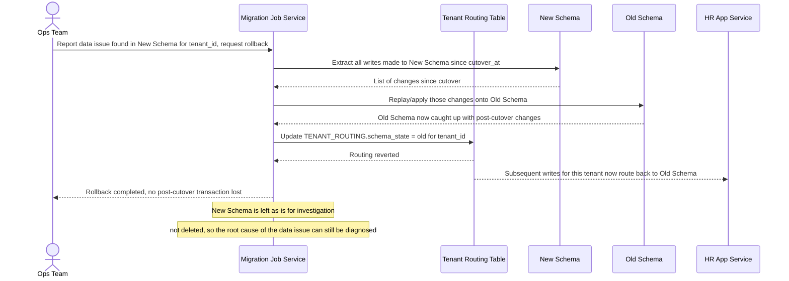

# Sequence Diagram — Enhance: Rollback After Cutover

Đây là **enhance**, flow mới xử lý khi phát hiện lỗi dữ liệu ở schema mới sau cutover: trả routing của tenant đó về schema cũ trong vòng vài phút mà không mất giao dịch nào đã ghi vào schema mới trong khoảng thời gian đã cutover. Flow này là checklist rollback được đề bài yêu cầu tường minh.

