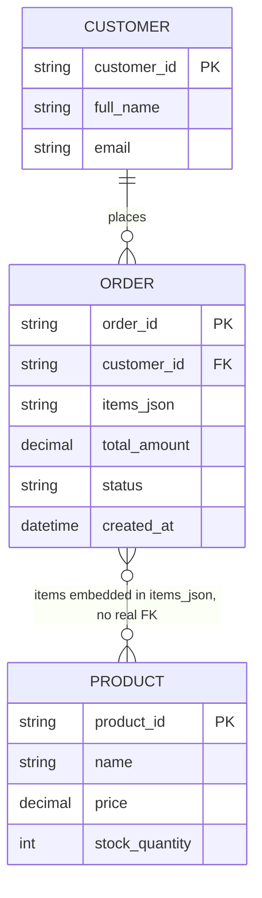

# ERD — Base (trước khi tách order_items)

Đây là **base**: mô hình dữ liệu suy luận cho sàn e-commerce *trước khi* tách bảng. Đề bài giả định đã tồn tại bảng `orders` lưu danh sách sản phẩm của đơn hàng dưới dạng JSON trong 1 cột — nếu không có sẵn `orders` với cột JSON đó thì yêu cầu "tách sang bảng order_items" sẽ không có nghĩa. ERD chỉ dựng phần lõi phục vụ tạo đơn hàng, không suy diễn thêm các module không liên quan (khuyến mãi, vận chuyển, thanh toán...).

