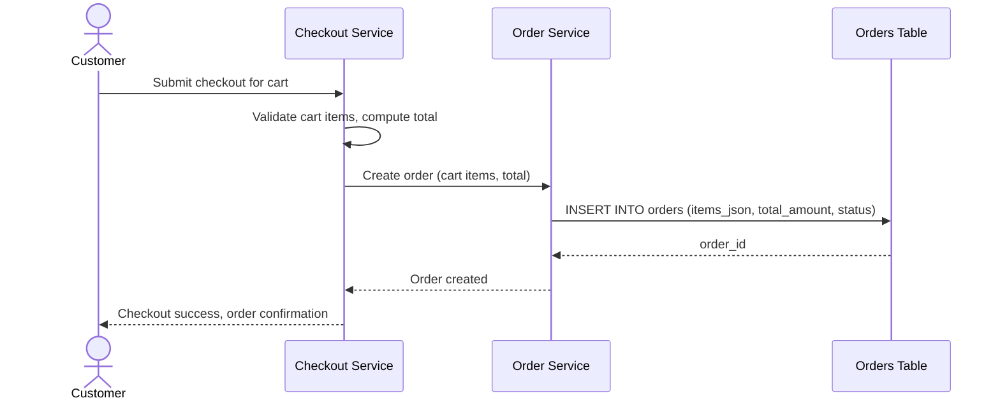

# Sequence Diagram — Base: Checkout Create Order

Đây là **base**, flow "tạo đơn hàng lúc checkout" — tiền đề bắt buộc cho việc tách bảng: chính flow này đang ghi toàn bộ danh sách item vào cột `items_json` của bảng `orders`, là nguồn dữ liệu duy nhất cần được dual-write sang bảng `order_items` mới ở enhance.

