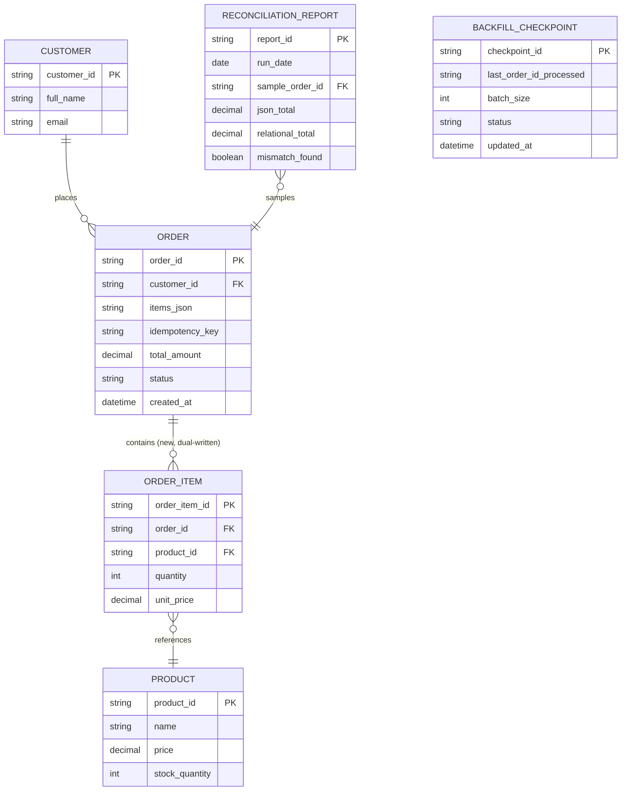

# ERD — Enhance (sau khi tách order_items)

Đây là **enhance**: ERD base cộng với các entity phục vụ đúng yêu cầu của đề bài — dual-write `order_items` quan hệ song song với `items_json` cũ, checkpoint cho job backfill, và báo cáo đối soát. So với base, `ORDER` giữ nguyên cột `items_json` (chưa drop, vẫn đang dual-write) và có thêm `idempotency_key` để chống double-submit; quan hệ `ORDER` — `PRODUCT` giờ đi qua `ORDER_ITEM` thật sự là FK thay vì chỉ nằm lỏng lẻo trong JSON.

