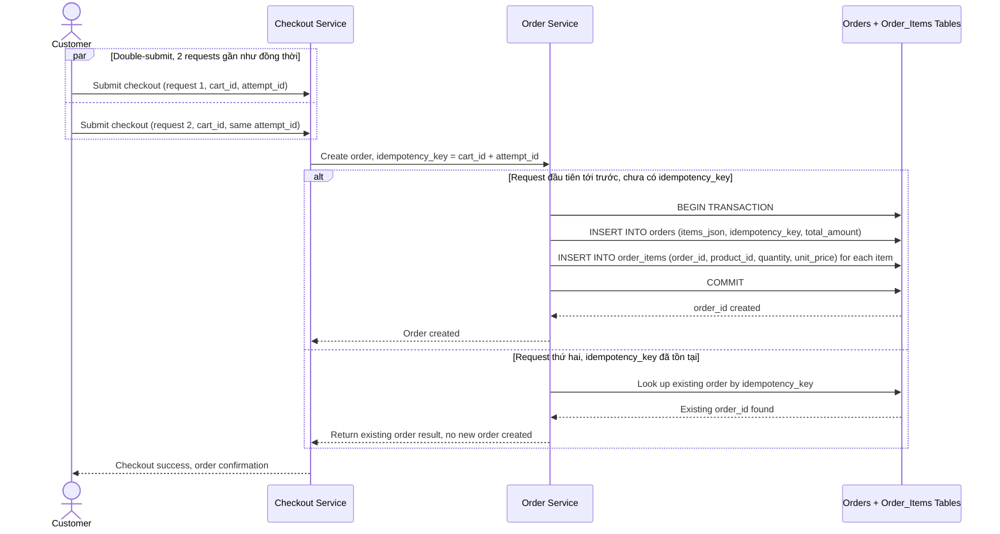

# Sequence Diagram — Enhance: Checkout Create Order

Đây là **enhance**, flow "tạo đơn hàng lúc checkout" đã tồn tại ở base ([2-base-checkout-create-order-sqd.md](2-base-checkout-create-order-sqd.md)) nay thay đổi lớn: ghi `orders` (items_json) và `order_items` phải nằm trong cùng 1 transaction DB, và phải chống double-submit bằng idempotency key theo `cart_id` + `checkout_attempt_id` khi user bấm checkout 2 lần gần như đồng thời.

