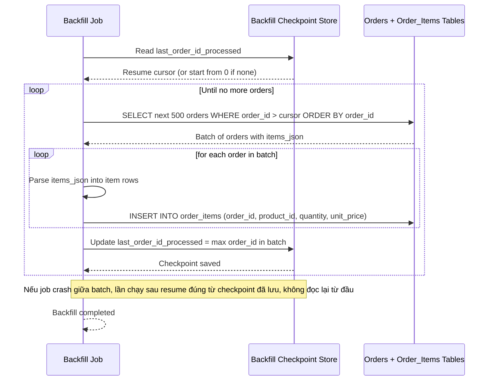

# Sequence Diagram — Enhance: Backfill Historical Orders

Đây là **enhance**, flow hoàn toàn mới: job backfill đọc các order lịch sử (tạo trước khi có dual-write) theo cursor `order_id` tăng dần, batch nhỏ 500 order/lần, có checkpoint để resume nếu crash giữa chừng thay vì đọc lại từ đầu.

