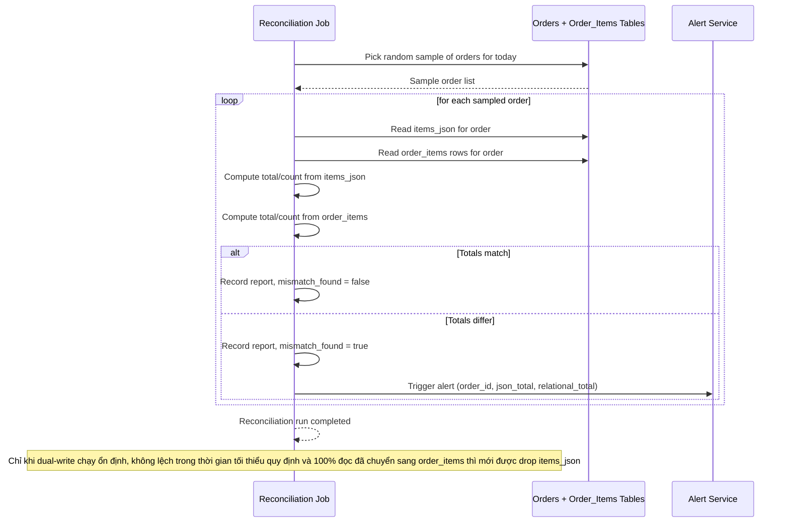

# Sequence Diagram — Enhance: Reconciliation Check

Đây là **enhance**, flow hoàn toàn mới: job đối soát hằng ngày so sánh số lượng/tổng tiền giữa cột `items_json` cũ và bảng `order_items` mới cho một mẫu order ngẫu nhiên, cảnh báo nếu lệch — điều kiện bắt buộc trước khi được phép drop cột JSON cũ.

