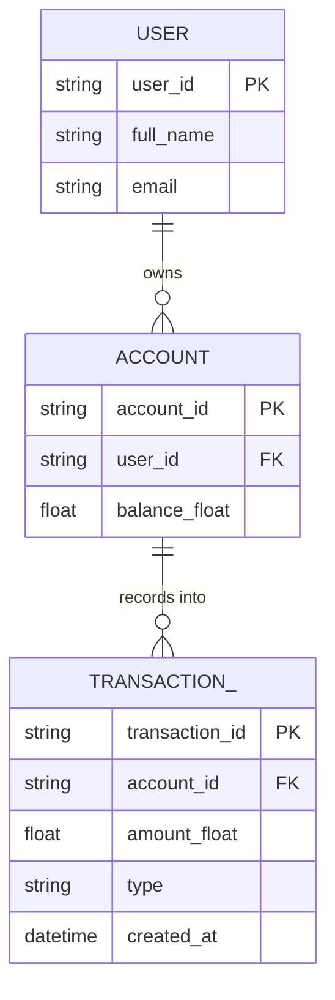

# ERD — Base (trước khi đổi sang lưu cents)

Đây là **base**: mô hình dữ liệu suy luận cho app quản lý chi tiêu cá nhân *trước khi* đổi đơn vị lưu trữ tiền tệ. Đề bài giả định đã có `USER` với 1 `ACCOUNT` lưu số dư dạng `float` và các `TRANSACTION` (giao dịch thu/chi) ghi nhận vào tài khoản đó — nếu không có sẵn cột `amount_float` thì yêu cầu "migrate sang amount_cents" sẽ không có nghĩa. ERD chỉ dựng phần lõi phục vụ giao dịch và số dư, không suy diễn thêm ngân sách/báo cáo/nhắc nhở không liên quan.

