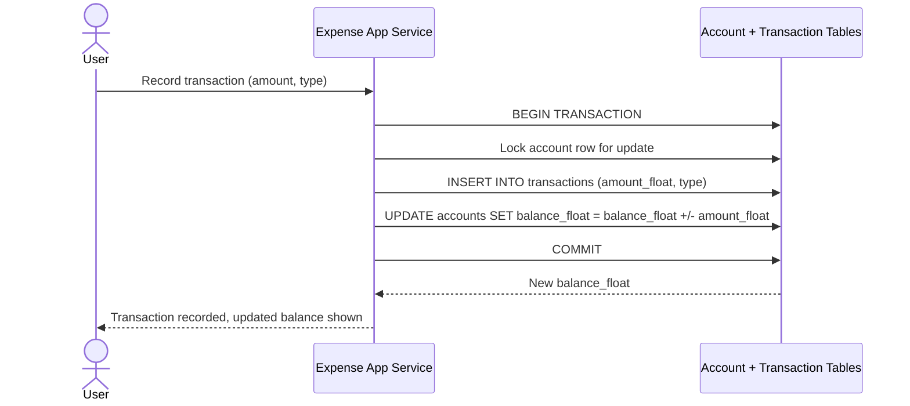

# Sequence Diagram — Base: Create Transaction

Đây là **base**, flow "tạo giao dịch thu/chi" — tiền đề bắt buộc cho việc đổi đơn vị lưu trữ: chính flow này ghi `amount_float` vào `TRANSACTION` và cập nhật `balance_float` của `ACCOUNT`, là nguồn dữ liệu phải được dual-write sang `amount_cents`/`balance_cents` ở enhance.

