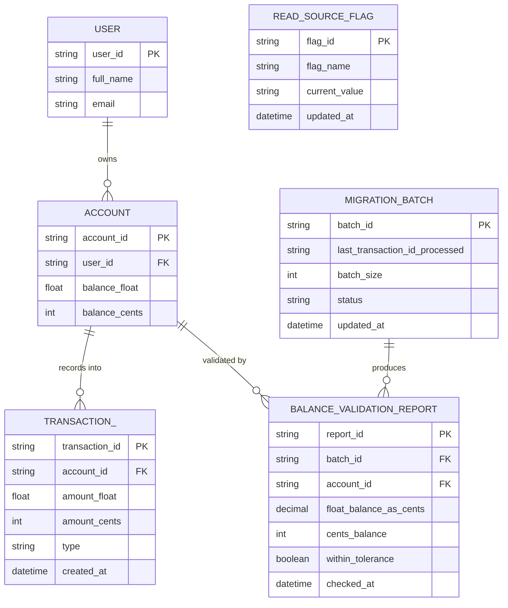

# ERD — Enhance (sau khi thêm cột cents)

Đây là **enhance**: ERD base cộng với cột `amount_cents`/`balance_cents` dual-write song song cột `float` cũ, checkpoint backfill, báo cáo validate từng batch, và feature flag cho phép rollback đọc ngay lập tức. So với base, `ACCOUNT` và `TRANSACTION_` không đổi cấu trúc bảng gốc nhưng có thêm cột `_cents`, và `READ_SOURCE_FLAG` là entity hoàn toàn mới quyết định hệ thống đang đọc từ cột nào.

