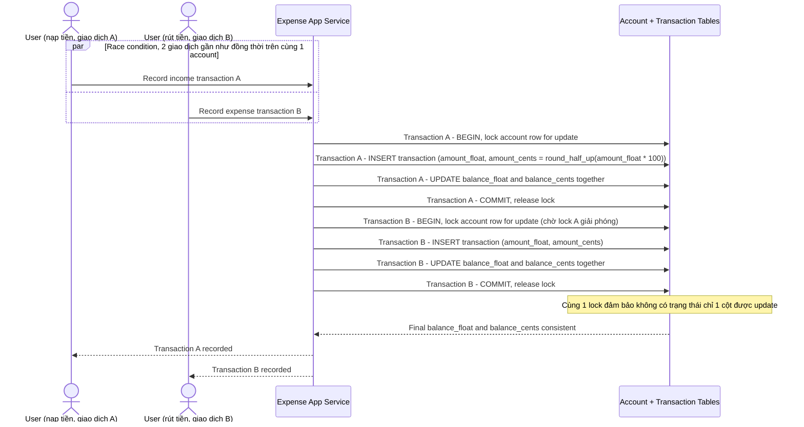

# Sequence Diagram — Enhance: Create Transaction

Đây là **enhance**, flow "tạo giao dịch" đã tồn tại ở base ([2-base-create-transaction-sqd.md](2-base-create-transaction-sqd.md)) nay thay đổi: mọi giao dịch mới phải ghi đồng thời `amount_float` và `amount_cents` (round-half-up) trong cùng 1 transaction, dùng cùng 1 lock trên dòng số dư, để race condition giữa giao dịch nạp tiền và rút tiền gần như đồng thời không làm lệch 2 cột.

