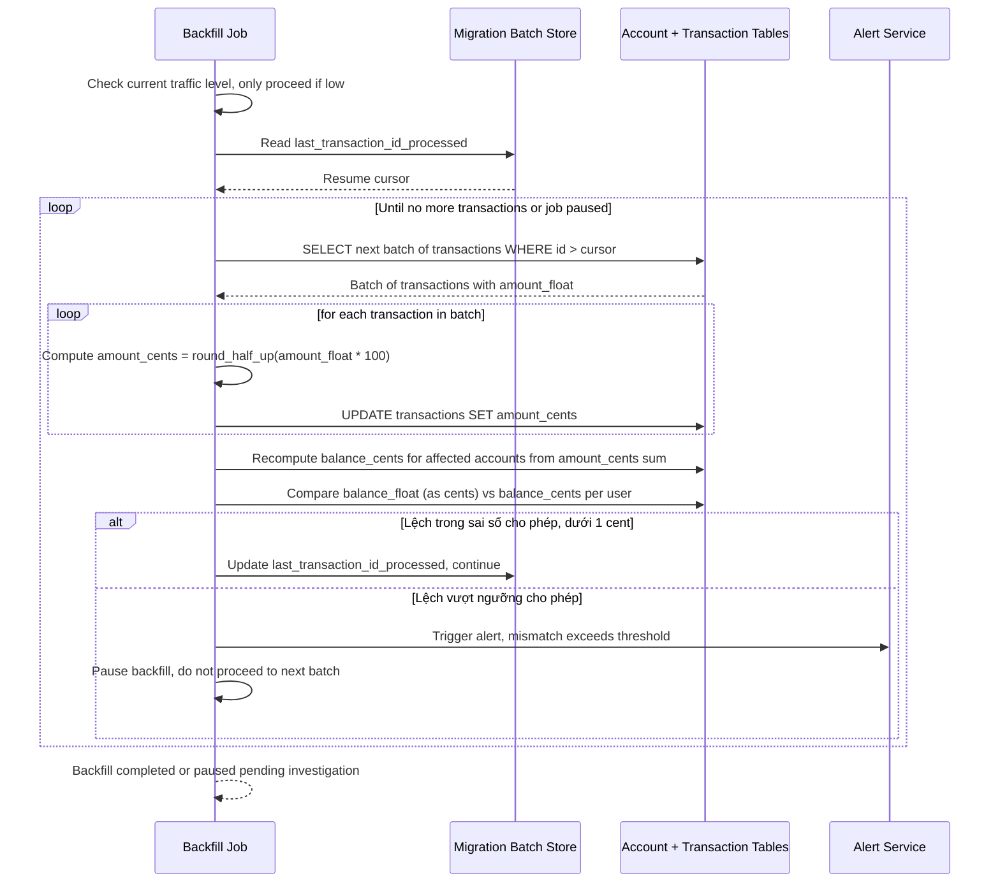

# Sequence Diagram — Enhance: Backfill Historical Transactions

Đây là **enhance**, flow hoàn toàn mới: job backfill tính lại `amount_cents` từ `amount_float` gốc theo batch ở giờ traffic thấp, validate tổng số dư sau mỗi batch và tự tạm dừng nếu tỷ lệ lệch vượt ngưỡng thay vì chạy tiếp và làm sai lệch số dư hàng loạt.

