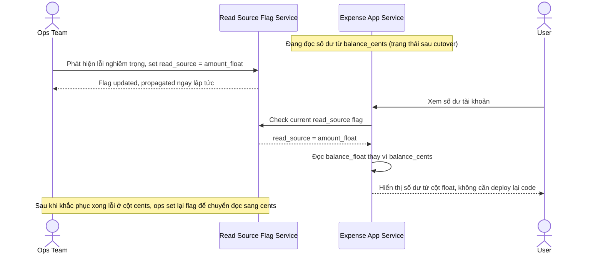

# Sequence Diagram — Enhance: Rollback via Feature Flag

Đây là **enhance**, flow hoàn toàn mới: khi hệ thống đã chuyển đọc số dư sang `balance_cents` nhưng phát hiện lỗi nghiêm trọng, ops phải có cách quay lại đọc `balance_float` ngay lập tức bằng feature flag, không cần deploy lại code.

