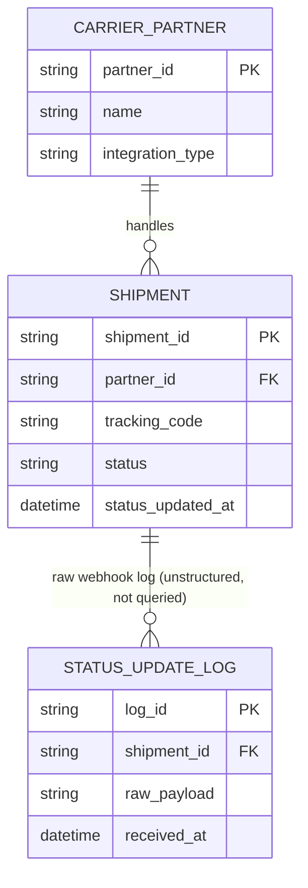

# ERD — Base (trước khi có bảng lịch sử trạng thái)

Đây là **base**: mô hình dữ liệu suy luận cho nền tảng logistics *trước khi* tách lịch sử trạng thái. Đề bài giả định đã có `SHIPMENT` với 1 cột `status` đơn, được nhiều `CARRIER_PARTNER` (đối tác vận chuyển) cập nhật qua webhook hoặc polling — nếu không có sẵn cột `status` đơn thì yêu cầu "chuyển sang bảng shipment_status_history" sẽ không có nghĩa. ERD chỉ dựng phần lõi phục vụ theo dõi trạng thái vận đơn, không suy diễn thêm định giá cước/thanh toán không liên quan.

