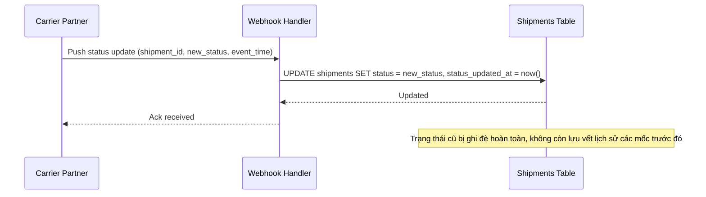

# Sequence Diagram — Base: Update Shipment Status

Đây là **base**, flow "cập nhật trạng thái vận đơn" — tiền đề bắt buộc cho việc tách bảng lịch sử: chính flow này ghi đè trực tiếp lên cột `status` của `SHIPMENT` mỗi khi có cập nhật, không lưu vết các mốc trạng thái trước đó — đây chính là hạn chế mà enhance phải giải quyết.

