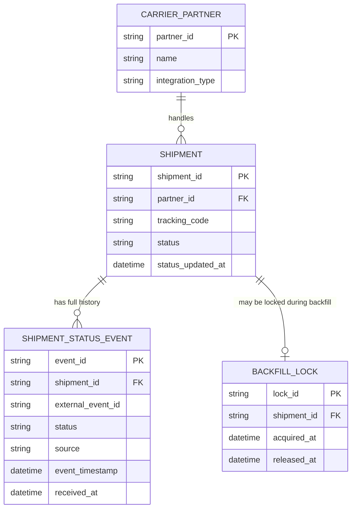

# ERD — Enhance (sau khi có bảng lịch sử trạng thái)

Đây là **enhance**: ERD base cộng với `SHIPMENT_STATUS_EVENT` lưu đầy đủ mọi mốc trạng thái, khóa idempotent theo mã sự kiện từ đối tác, và cơ chế khóa/checkpoint cho backfill. So với base, cột `status` trên `SHIPMENT` không đổi ý nghĩa (vẫn là trạng thái mới nhất) nhưng nay được suy ra từ `SHIPMENT_STATUS_EVENT` có `event_timestamp` lớn nhất, thay vì chỉ đơn giản là giá trị ghi đè cuối cùng theo thứ tự xử lý.

