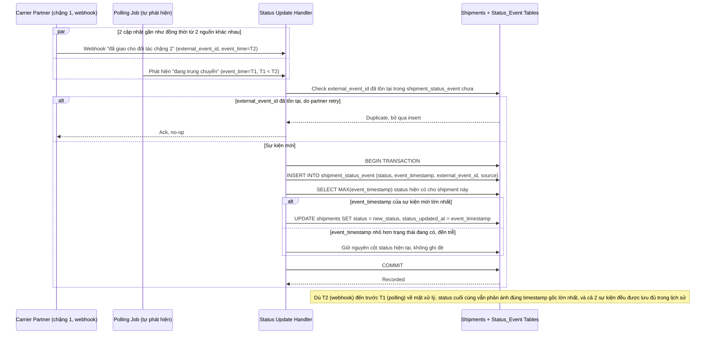

# Sequence Diagram — Enhance: Update Shipment Status

Đây là **enhance**, flow "cập nhật trạng thái vận đơn" đã tồn tại ở base ([2-base-update-shipment-status-sqd.md](2-base-update-shipment-status-sqd.md)) nay thay đổi lớn: mỗi cập nhật phải insert thêm 1 dòng vào `SHIPMENT_STATUS_EVENT` (dual-write cùng transaction với cột `status` cũ), cột `status` chỉ được ghi đè nếu `event_timestamp` mới lớn hơn timestamp hiện tại (không phải thời điểm hệ thống nhận được), và webhook trùng lặp phải idempotent theo `external_event_id`.

