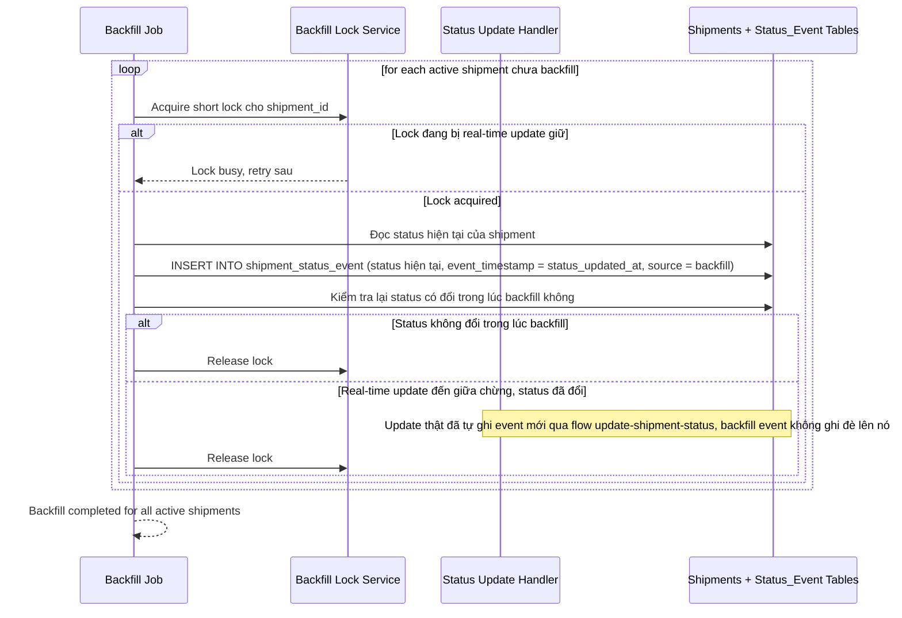

# Sequence Diagram — Enhance: Backfill Active Shipments

Đây là **enhance**, flow hoàn toàn mới: job backfill tạo `SHIPMENT_STATUS_EVENT` khởi tạo cho các vận đơn đang active từ trạng thái hiện có, dùng khóa ngắn trên từng vận đơn để không bị real-time update đến giữa chừng ghi đè mất.

