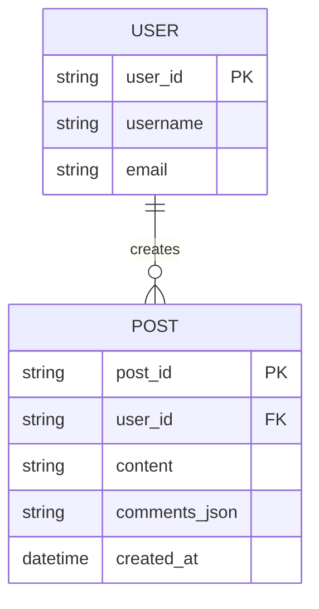

# ERD — Base (trước khi tách bảng comments)

Đây là **base**: mô hình dữ liệu suy luận cho mạng xã hội *trước khi* tách comment. Đề bài giả định đã có `USER` đăng `POST`, và comment được lưu nested/JSON ngay trong 1 cột của `POST` — nếu không có sẵn cột JSON đó thì yêu cầu "tách sang bảng comments quan hệ riêng" sẽ không có nghĩa. ERD chỉ dựng phần lõi phục vụ đăng bài/bình luận, không suy diễn thêm like/share/notification không liên quan.

