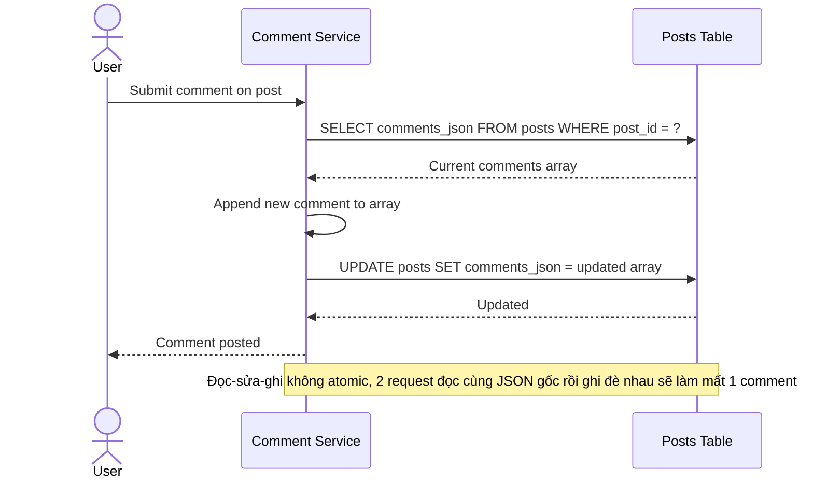

# Sequence Diagram — Base: Create Comment

Đây là **base**, flow "bình luận vào bài viết" — tiền đề bắt buộc cho việc tách bảng: chính flow này đọc mảng JSON hiện tại, append comment mới, rồi ghi lại cả mảng vào cột `comments_json` của `POST` — cách đọc-sửa-ghi này là nguồn gốc rủi ro mất comment mà enhance phải xử lý.

