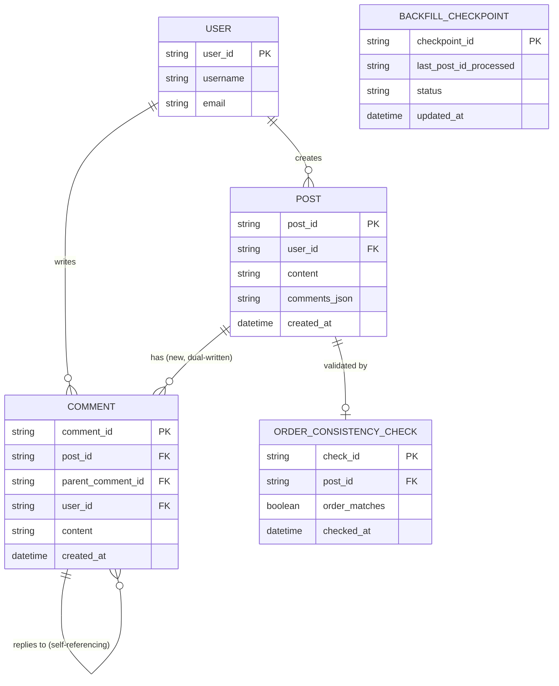

# ERD — Enhance (sau khi tách bảng comments)

Đây là **enhance**: ERD base cộng với bảng `COMMENT` quan hệ, tự tham chiếu để hỗ trợ trả lời lồng nhiều cấp, checkpoint backfill theo bài viết, và báo cáo đối soát thứ tự/nội dung. So với base, `POST` giữ nguyên `comments_json` (chưa drop, vẫn dual-write) trong khi `COMMENT` là bảng hoàn toàn mới cho phép mỗi comment là 1 dòng riêng, có `parent_comment_id` tự tham chiếu để biểu diễn reply lồng cấp — điều JSON cũ không hỗ trợ tốt.

