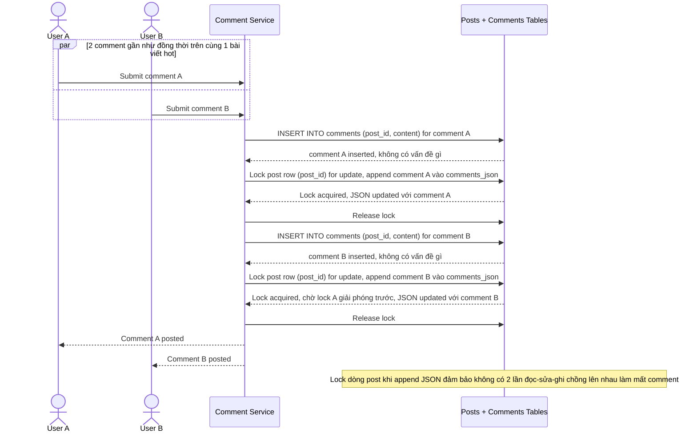

# Sequence Diagram — Enhance: Create Comment

Đây là **enhance**, flow "bình luận vào bài viết" đã tồn tại ở base ([2-base-create-comment-sqd.md](2-base-create-comment-sqd.md)) nay thay đổi: bảng `COMMENT` insert bình thường không có vấn đề, nhưng ghi vào `comments_json` cũ phải lock dòng post trong lúc append để 2 comment gần như đồng thời trên 1 bài hot không ghi đè mất nhau.

