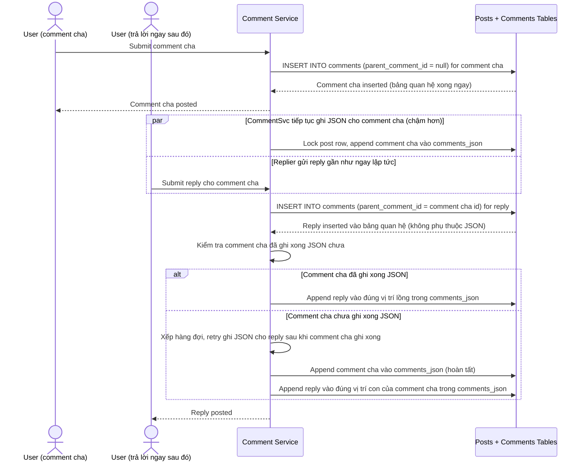

# Sequence Diagram — Enhance: Create Reply Comment

Đây là **enhance**, flow hoàn toàn mới: bình luận trả lời 1 comment cha, cần chờ comment cha ghi xong JSON cũ trước khi cho phép xử lý reply, để không bị ghi vào `comments_json` sai vị trí cấu trúc lồng do append JSON có độ trễ cao hơn insert bảng `COMMENT`.

