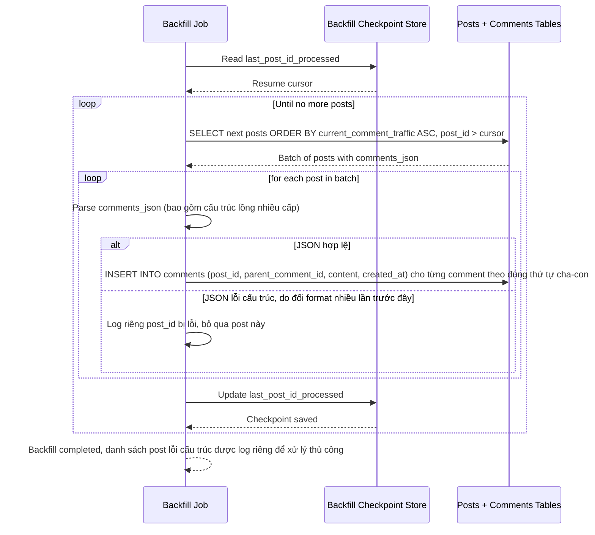

# Sequence Diagram — Enhance: Backfill Historical Comments

Đây là **enhance**, flow hoàn toàn mới: job backfill comment lịch sử từ `comments_json` sang bảng `COMMENT`, ưu tiên bài viết ít traffic bình luận trước, có checkpoint resume, và bỏ qua riêng các bài có JSON lỗi cấu trúc thay vì crash toàn bộ job.

