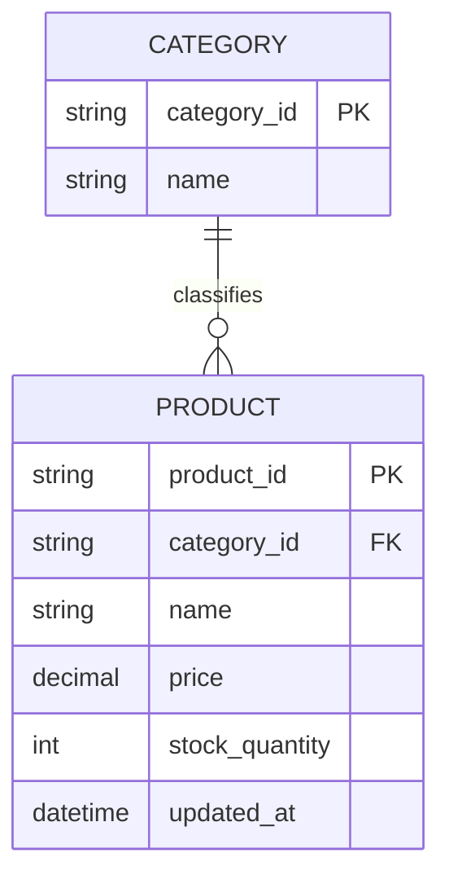

# ERD — Base (trước khi có search index)

Đây là **base**: mô hình dữ liệu suy luận cho sàn e-commerce *trước khi* có pipeline đồng bộ vào search index riêng. Đề bài giả định đã có `PRODUCT` với tên/giá/tồn kho/danh mục lưu trong database chính — nếu không có sẵn dữ liệu sản phẩm này thì yêu cầu "đồng bộ vào search index" sẽ không có nghĩa. Tìm kiếm ở base được suy luận là chạy trực tiếp trên database chính (query LIKE/filter cơ bản), chưa có autocomplete hay xử lý lỗi chính tả/đồng nghĩa.

