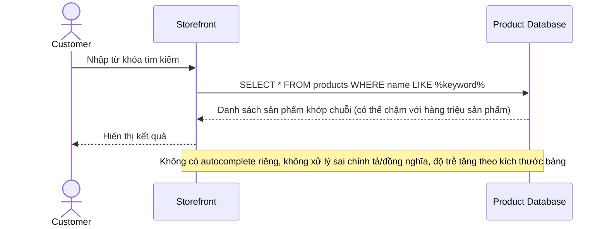

# Sequence Diagram — Base: Search Product

Đây là **base**, flow "tìm kiếm sản phẩm" chạy trực tiếp trên database chính — tiền đề cho thấy hạn chế mà enhance phải giải quyết: query trực tiếp trên hàng triệu sản phẩm chậm, không có autocomplete, không xử lý lỗi chính tả/đồng nghĩa, và không tự phản ánh ngay khi giá/tồn kho đổi.

