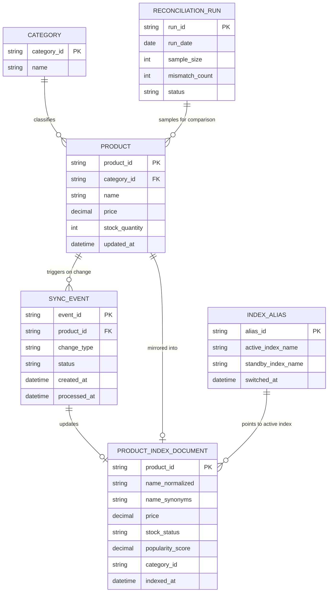

# ERD — Enhance (sau khi có search index)

Đây là **enhance**: ERD base cộng với `PRODUCT_INDEX_DOCUMENT` (tài liệu index phục vụ autocomplete/tìm kiếm, có các trường chuẩn hóa cho lỗi chính tả/đồng nghĩa/dấu tiếng Việt), `SYNC_EVENT` ghi nhận thay đổi cần đồng bộ, `INDEX_ALIAS` để swap giữa 2 index song song khi reindex, và `RECONCILIATION_RUN` đối soát định kỳ. So với base, `PRODUCT` không đổi cấu trúc nhưng mọi thay đổi giờ phát sinh `SYNC_EVENT` để đẩy vào index gần thời gian thực thay vì chỉ tồn tại trong DB chính.

