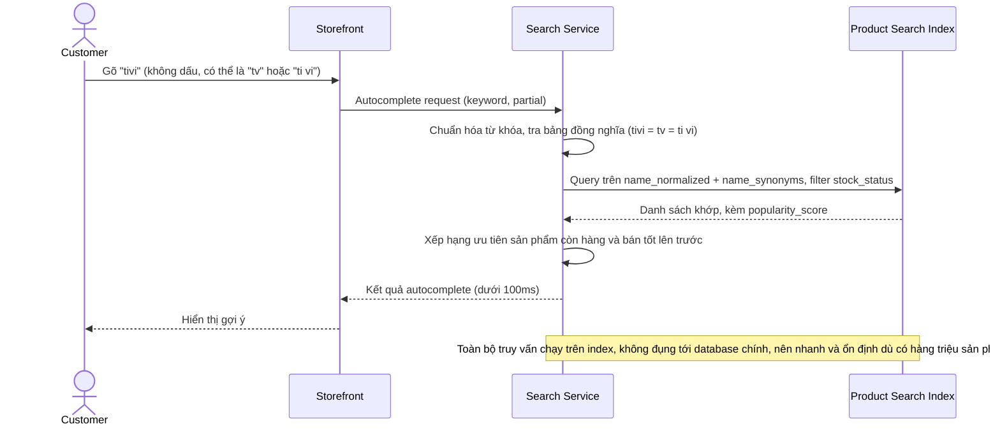

# Sequence Diagram — Enhance: Search Product

Đây là **enhance**, flow "tìm kiếm sản phẩm" đã tồn tại ở base ([2-base-search-product-sqd.md](2-base-search-product-sqd.md)) nay thay đổi hoàn toàn: query chuyển sang chạy trên `PRODUCT_INDEX_DOCUMENT` thay vì DB chính, autocomplete trả kết quả dưới 100ms, ưu tiên sản phẩm còn hàng/bán tốt, và xử lý được lỗi chính tả/đồng nghĩa/dấu tiếng Việt.

